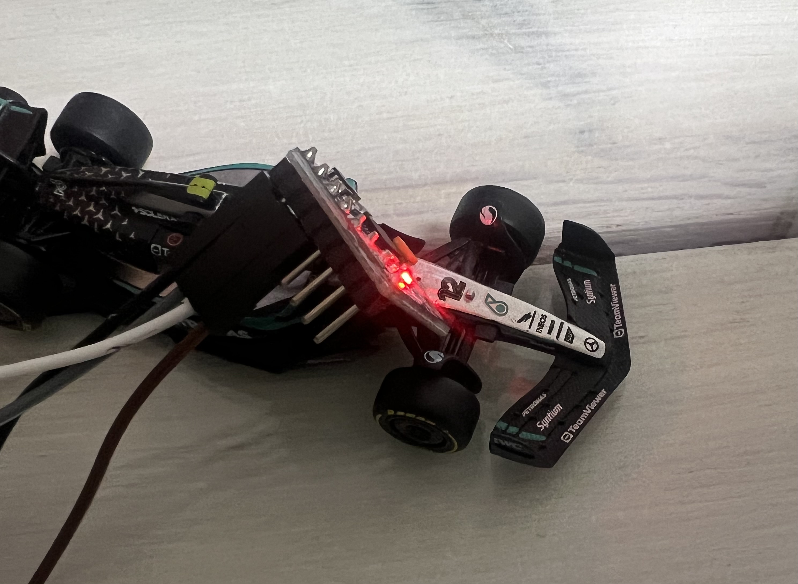
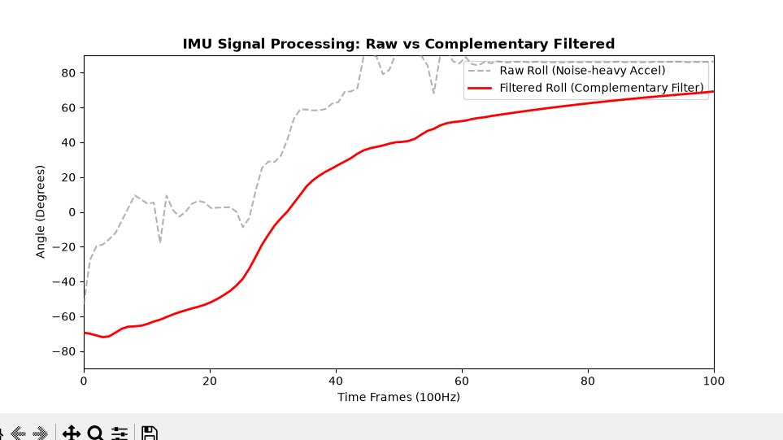
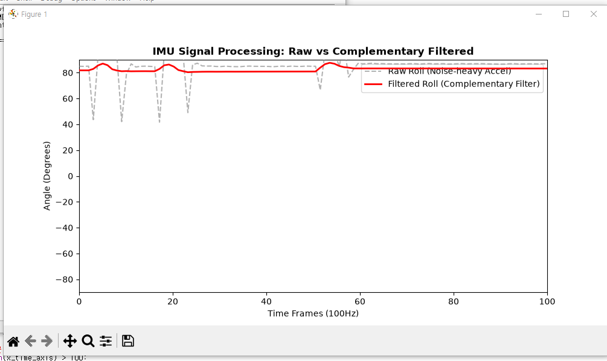
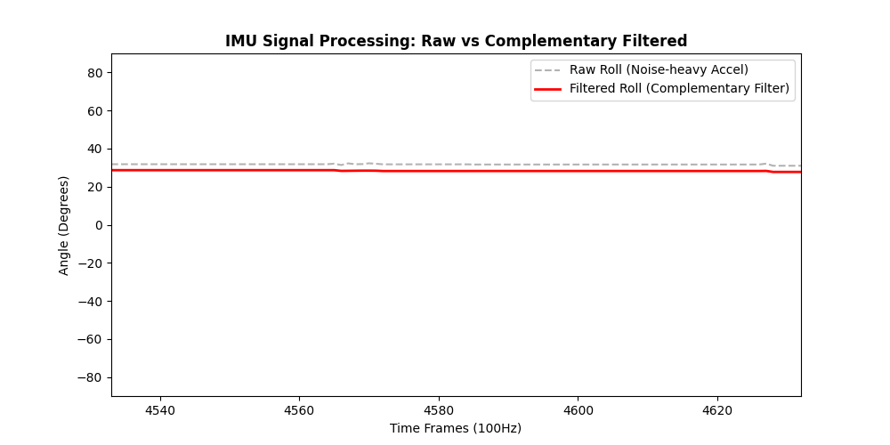
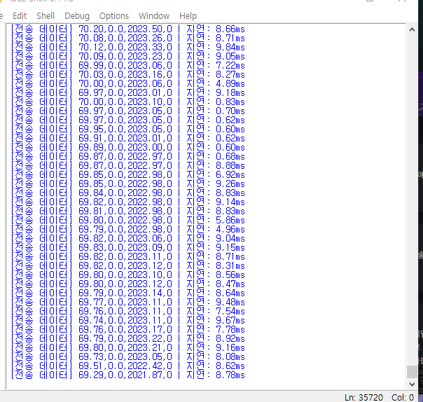
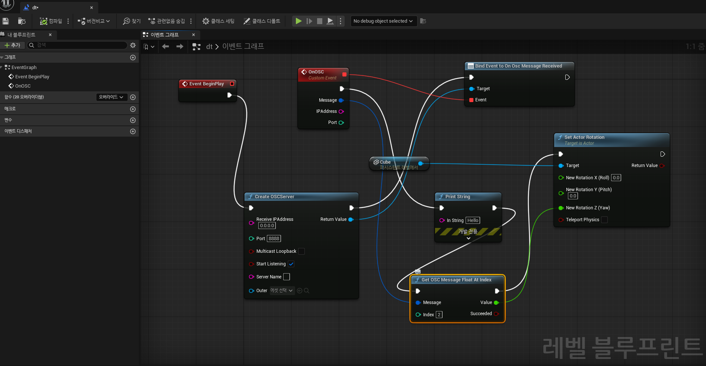

# 모빌리티 디지털 트윈 (Mobility Digital Twin)

장난감 자동차에 부착한 IMU 센서의 물리적 움직임을 상보필터로 처리해
언리얼 엔진 가상 객체에 실시간 동기화하는 저비용 디지털 트윈 프로토타입.

🎥 **[시연 영상 - Unreal Engine 5 OSC 실시간 동기화](https://youtube.com/shorts/GTTLsXyAtNc?feature=share)**
🎥 **[시연 영상 - Python 경량 트윈 시각화](https://youtube.com/shorts/nyQxU3En3Ws?feature=share)**

---

## 시스템 구조
MPU-6050 (IMU) → Arduino Nano (I2C 수집 + 상보필터, 100Hz)
→ Serial 115200 → Python (중계 + 지연 실측)
→ OSC/UDP :8888 → Unreal Engine 5.8 (액터 회전 동기화)

## 핵심 구현

- **센서 퓨전**: 상보필터(계수 0.98)로 가속도계의 진동 노이즈와
  자이로의 적분 드리프트를 상호 보정
- **방향 추적**: 자이로 Z축 적분 기반 요(Yaw) 계산
- **상태 감지**: 3축 가속도 벡터 합성으로 이동/정지 판별
- **실시간 중계**: Serial → OSC 파이프라인, 패킷 단위 지연 실측
- **엔진 연동**: 언리얼 블루프린트 OSC 서버 수신 → 액터 회전 실시간 매핑

## 하드웨어 (총 ~13,000원)

| 부품 | 역할 |
|------|------|
| Arduino Nano (CH340, USB-C) | 센서 수집 + 필터링 |
| MPU-6050 (GY-521) | 3축 가속도 + 자이로 |
| 브레드보드 400홀, 점퍼선 | 배선 |

배선: VCC-5V, GND-GND, SDA-A4, SCL-A5 (I2C)

## 신호처리 검증

**① 회전 + 연속 외란 구간**

센서를 크게 회전시키며 외란을 인가한 구간. 필터 미적용 Raw 각도
(회색 점선)는 ±50° 이상 요동치는 반면, 상보필터 적용 후(빨간 실선)는
노이즈를 억제하며 실제 자세 변화만 안정적으로 추종.

**② 정지 상태 + 충격성 외란 구간**

정지 상태에서 센서에 순간 충격(두드림)을 인가한 구간. Raw 각도는
충격마다 최대 40° 이상 급락하지만, 필터 적용 후에는 미세한 흔들림만
보이며 실제 자세(정지)를 유지.

**③ 정지 상태 베이스라인**

외란이 없는 정지 상태에서 두 신호 모두 안정적으로 수렴 —
필터가 정상 신호를 왜곡하지 않음을 확인.

## 전송 지연 실측

시리얼 수신부터 OSC 포워딩까지의 파이프라인 지연을 패킷 단위로
실측한 결과 0.6~9.7ms 범위로, 100Hz 실시간 동기화에 충분한 성능을
확인. 누적 35,000+ 패킷 처리 중 크래시 없이 안정 구동.

## 언리얼 엔진 연동

OSC 플러그인 기반 수신 서버를 블루프린트로 구성.
OnOscMessageReceived 이벤트에서 요(Yaw) 값을 추출해 액터의
Z축 회전에 실시간 매핑.

## 실행 방법

1. `arduino/imu_car.ino` 업로드
   (보드: Arduino Nano, 업로드 실패 시 프로세서를
   ATmega328P (Old Bootloader)로 변경)
2. `pip install pyserial matplotlib python-osc`
3. `python/relay.py` 실행 (COM 포트 번호 수정 필요)
4. 언리얼: OSC 플러그인 활성화 → 레벨 블루프린트에
   OSC 서버(0.0.0.0:8888) 구성 → Play

## 트러블슈팅 기록

| 문제 | 해결 |
|------|------|
| CH340 호환보드 미인식 | 드라이버 수동 설치 + Old Bootloader 선택 |
| Python-IDE 시리얼 포트 충돌 | 포트 단일 점유 특성 진단, 실행 순서 정립 |
| GPU(GTX 1060 3GB) VRAM 부족 크래시 | ScreenPercentage·확장성 세팅 조정 |
| raw UDP 문자열 언리얼 비호환 | python-osc 기반 OSC 프로토콜로 전환 |
| OSC 서버 127.0.0.1 바인딩 수신 실패 | 수신 주소 0.0.0.0으로 변경 |

## 한계 및 확장 계획

- IMU 단독으로는 위치 추적 불가(가속도 이중적분 드리프트)
  → 휠 엔코더 융합으로 확장 가능
- 자이로 요(Yaw) 드리프트 존재 → 지자기 센서 융합(9축)으로 개선 가능
- 장시간 구동 시 콘솔 출력 병목으로 지연 증가
  → 출력 스로틀링으로 개선 가능
- 동일 파이프라인으로 카메라 리그(버추얼 프로덕션) 응용 가능

## 배운 점

- 센서 원시값은 그대로 사용할 수 없으며, 노이즈와 드리프트의 특성을
  이해한 필터 설계가 필수임을 실측으로 확인
- 실시간 파이프라인에서 프로토콜(UDP vs OSC) 선택과 포트/바인딩
  설정이 시스템 연동의 핵심임을 경험
- 하드웨어 제약(GPU VRAM) 상황에서 렌더 설정 조정으로
  트레이드오프를 관리하는 경험
